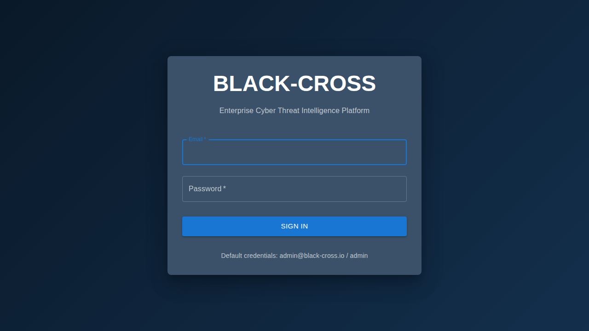
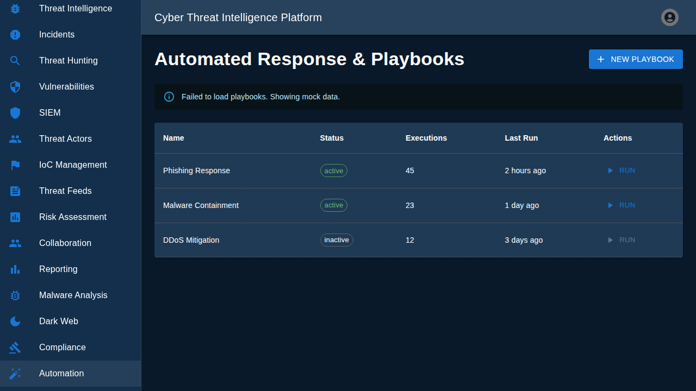
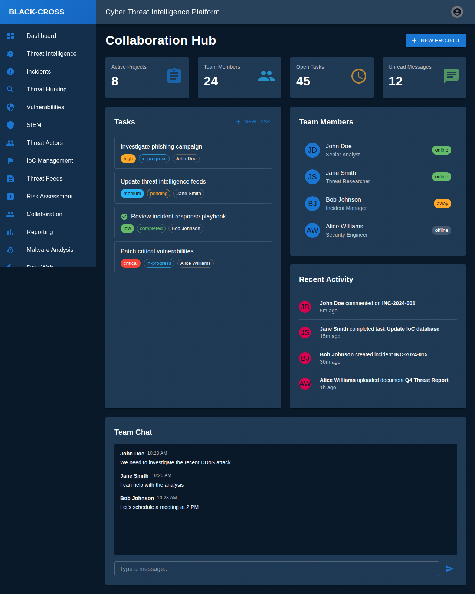
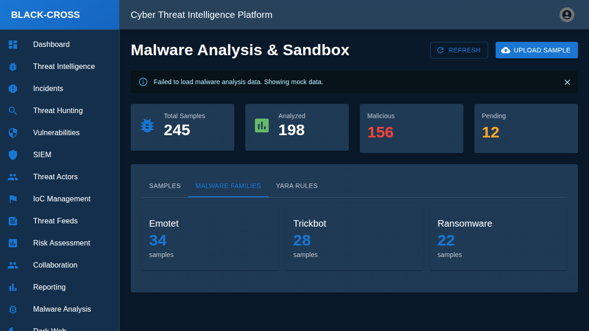
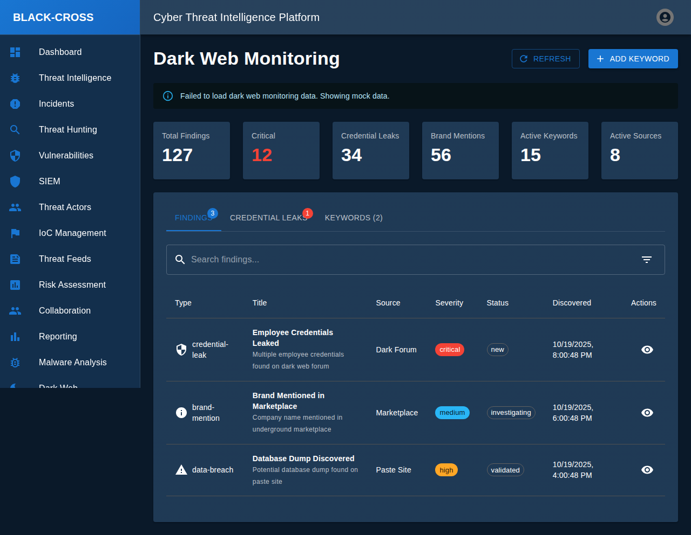
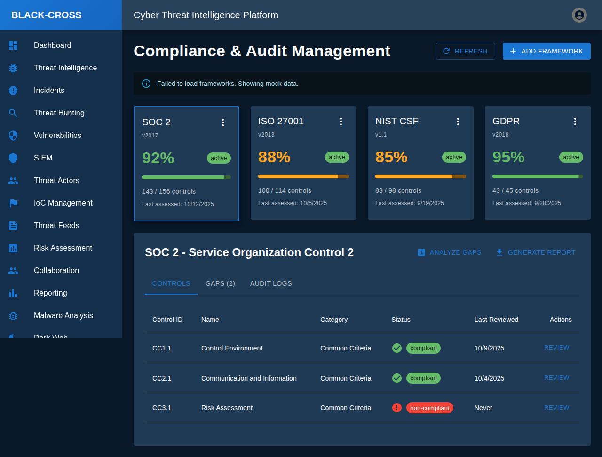

# Black-Cross Platform Screenshots

This directory contains comprehensive screenshots of all pages in the Black-Cross Enterprise Cyber Threat Intelligence Platform, including main pages and detailed tab/interaction views.

## Quick Reference

### Main Pages (17 screenshots)

| Screenshot | Page Name | Description |
|------------|-----------|-------------|
|  | **Login** | Authentication page with email/password form |
|  | **Dashboard** | Main landing page with platform overview |
|  | **Threat Intelligence** | Threat data management and search |
|  | **Incident Response** | Security incident tracking and management |
|  | **Threat Hunting** | Advanced threat hunting with query builder |
|  | **Vulnerability Management** | CVE tracking and risk assessment |
|  | **SIEM Dashboard** | Real-time security events and alerts |
|  | **Threat Actors** | Threat actor database and profiling |
|  | **IoC Management** | Indicators of Compromise management |
|  | **Threat Feeds** | External threat intelligence feeds |
|  | **Risk Assessment** | Organizational risk evaluation |
|  | **Collaboration Hub** | Team workspace with tasks and chat |
|  | **Reporting & Analytics** | KPIs, charts, and report generation |
|  | **Malware Analysis** | File analysis and sandbox environment |
|  | **Dark Web Monitoring** | Dark web threat tracking |
|  | **Compliance Management** | Framework compliance tracking |
|  | **Automation Playbooks** | Security automation and orchestration |

### Detail Views & Tab Interactions (5 screenshots)

| Screenshot | View/Tab | Description |
|------------|----------|-------------|
|  | **Collaboration Detail** | Fully loaded collaboration hub with tasks and chat |
|  | **Malware Families** | Malware classification by family |
|  | **YARA Rules** | Detection rule management |
|  | **Credential Leaks** | Dark web credential monitoring |
|  | **Compliance Gaps** | Gap analysis and remediation |

## Full Documentation

For detailed descriptions of each page, features, and technical details, see [SCREENSHOTS.md](../SCREENSHOTS.md).

## Screenshot Information

- **Total Screenshots:** 22 (17 main pages + 5 detail views)
- **Capture Date:** October 19, 2025
- **Format:** PNG (full-page captures)
- **Total Size:** ~2.9 MB
- **Tool Used:** Playwright Browser Automation

## Usage

These screenshots serve as:
- Visual documentation of the platform's capabilities
- Reference for UI/UX design
- Training materials for new users
- Product demonstration assets
- Development verification
- Documentation of tab interactions and detail views

---

*For the complete platform documentation, visit the [docs/](../) directory.*
